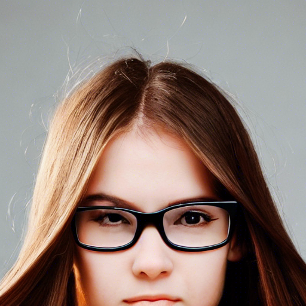

# AI绘画调研
> 最近在B站上刷到很多关于AI绘画的视频，看着效果都非常好，所以我这里也简单对目前比较火的AI模型进行调研，对比一下各自的效果

# stable-diffusion

目前比较火的基本上就是stable-diffusion了，这里主要会对比三个模型 官方模型、wifu模型、novel模型

## 官方项目
官方项目其实并不是专门针对二次元的，所以在生成动漫画面上还是有一点不足的

仓库地址：https://github.com/CompVis/stable-diffusion

模型地址：https://huggingface.co/CompVis

最新模型下载地址：https://huggingface.co/CompVis/stable-diffusion-v-1-4-original

安装运行方法如下
```shell
# 克隆代码
git clone https://github.com/CompVis/stable-diffusion
# 直接根据项目的的环境文件来生成conda环境
conda env create -f environment.yaml
conda activate ldm
# 然后在项目里面新建一个文件夹存放我们的模型文件
mkdir -p models/ldm/stable-diffusion-v1
# 可以使用软连接映射一下模型，不过也可以直接改成model.ckpt然后放到这个目录下就可以了
ln -s <path/to/model.ckpt> models/ldm/stable-diffusion-v1/model.ckpt 

# 然后直接运行，注意这里加了一个n_samples是为了避免爆显存
python scripts/txt2img.py --prompt "A girl with long hair and glasses" --plms --n_samples 1
```

上面是让模型生成一个带着眼镜的长发女孩，效果如下：



## WEB项目

官方项目必须要在命令行中运行，操作起来会有诸多不便，下面我们找一个三方的web界面来进行操作

仓库地址:https://github.com/AUTOMATIC1111/stable-diffusion-webui

项目运行命令如下

```shell
git clone https://github.com/AUTOMATIC1111/stable-diffusion-webui
# 安装必要依赖
pip install -r requirements_versions.txt
# 注意，我们需要把模型放到models/Stable-diffusion 目录下即可
# 启动项目，这里会克隆一些必要的仓库和依赖，耐心等待完成即可
python launch.py
# 如果安装完依赖后就可以直接使用下面的命令直接启动项目，这里我们需要关闭安全检查，要不然会无法启动
python webui.py --disable-safe-unpickle
```

启动后访问：http://127.0.0.1:7860 就可以了，我们同样让模型生成一个带眼睛的长发女孩，效果如下


## wifu模型

官方提供的模型主要还是以三次元为主，所以我们想生成二次元图片的话，可以使用别人提供的模型。比如wifu模型就是专门针对二次元开发的

作者的huggingface空间：https://huggingface.co/hakurei

模型下载地址：https://huggingface.co/hakurei/waifu-diffusion-v1-3

自己下载模型后直接放到那个webUi的models目录下，重启一下就可以看到了，效果如下


我们使用作者提供的关键词 

1girl, aqua eyes, baseball cap, blonde hair, closed mouth, earrings, green background, hat, hoop earrings, jewelry, looking at viewer, shirt, short hair, simple background, solo, upper body, yellow shirt

效果如下


## novel模型
这个模型其实是被黑客泄露的，目前整个内容大小为52G，包括了训练代码以及模型（磁链如下，侵删）
```shell
magnet:?xt=urn:btih:5bde442da86265b670a3e5ea3163afad2c6f8ecc
```
可以使用大模型或者小模型。大模型的效果会更好，当然还有其他的模型，


生成的效果如下：


下面我们把风格化文件也放进去，也就是把`novelaileak\stableckpt\modules\modules` 放到 `stable-diffusion-webui\models\hypernetworks\` 里去，然后再重启一下

然后在设置的选项卡的Stable Diffusion栏就可以看到了


## 调参指南

> 参考：https://www.bilibili.com/video/BV1se4y1q7Sp

默认情况下生成的图片效果并不是很好，下面给大家介绍一下怎么让生成的图片更好看

首先就是我们可以先把下面这些参数都放到负向标签里去
```shell
lowres, bad anatomy, bad hands, text, error, missing fingers, extra digit, fewer digits, cropped, worst quality, low quality, normal quality, jpeg artifacts, signature, watermark, username, blurrypolar lowres,bad anatomy,bad hands,bad body,bad proportions,gross proportions,text,error,missing fingers,missing arms,missing legs,extra digit,

extra fingers,fewer digits,extra limbs,extra arms,extra legs,malformed limbs,fused fingers,too many fingers,long neck,cross-eyed,mutated hands,

cropped,poorly drawn hands,poorly drawn face,mutation,deformed,worst quality,low quality,normal quality,jpeg artifacts,signature,watermark,

username,blurry,ugly,duplicate,morbid,mutilated,out of frame,body out of frame
```

然后正向的标签可以放下面这些，越靠前的标签权重越高，后面再放我们自己的标签
```shell
masterpiece, best quality,highly detailed,1girl
```

我们这里继续用长发眼镜少女来举例，然后参数配置如下，可以看到生成的照片更好看了


然后我们再从中选出一张自己喜欢的，选择image 2 image功能，然后对这个图片进行微调


后面就是不断的选择图片，添加更多的描述，进行微调，这样就可以得到一个不错的图片了，比如我加了一个夏日长裙的tag


效果如下：


后面我就懒得调了，感兴趣的可以自己调

## 魔咒百科词典

因为AI绘画是根据英文描述来生成的，对于我们这种英文不好的人来说不太友好，所有就有大佬整理了一些关键词。感兴趣的可以自己去搜

这里分享一下一个大佬做的一个网站，可以像购物一样选择不同的属性，然后自己直接生成即可网站，地址：https://aitag.top/


